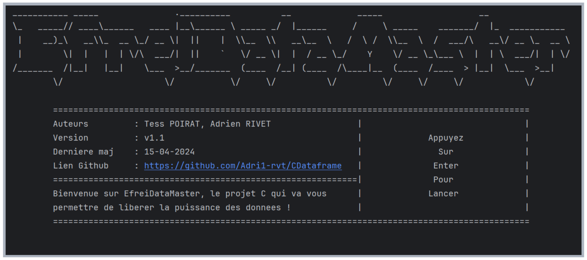
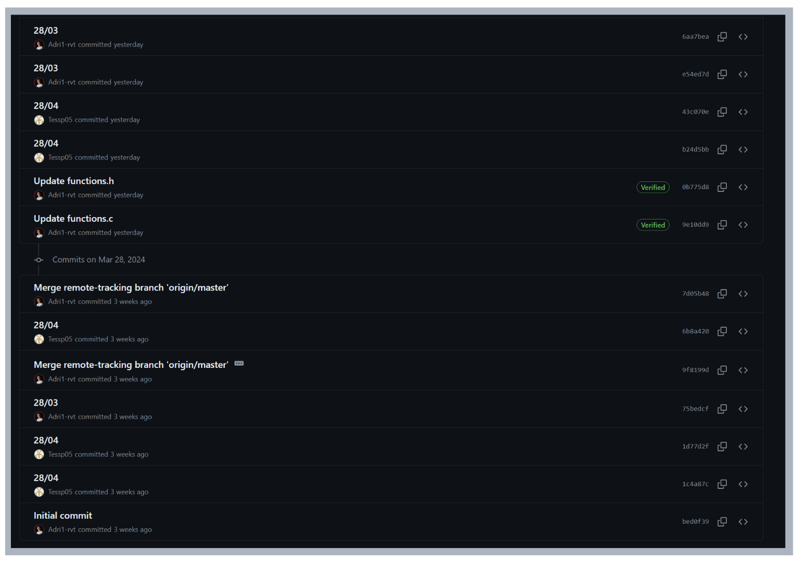

<!-- Bonjour, nous avons choisi de rédiger notre fichier README en format Markdown (.md). Par consèquent, il sera plus simple et plus beau à visualiser depuis GitHub ou depuis un IDE tel CLion. Bonne lecture ! -->
<!-- Lien vers notre GitHub : https://github.com/Adri1-rvt/EfreiDataMaster -->

<h1 align="center">
  <br>
  <a href="http://www.amitmerchant.com/electron-markdownify"></a>
  <br>
  EfreiDataMaster, par Tess & Adrien
  <br>
</h1>

<h4 align="center">Libérez toute la puissance des données en C !</h4>

<p align="center">
  <a href="#Présentation-du-projet">Présentation</a> •
  <a href="#Comment-utiliser">Comment utiliser</a> •
  <a href="#Télécharger">Télécharger</a> •
  <a href="#crédits">Crédits</a> •
  <a href="#license">License</a>
</p>



## Présentation du projet

Vous connaisez la librairie Pandas en python ? Si oui vous savez à quel point le traitement de données peut être utile et puissant (quoique parfois laborieux). Malheureusement, il n'y a pas d'équivalent de cette librairie en C ! Grâce au principe des CDataframes, nous avons donc codé notre propre librairie C de traitement de donnéees !<br>
Nous avons opté pour un cdataframe sous forme de tableau dynamique constitué de colonnes d'entiers ou de différents types de données (au choix), avec des fonctionnalités simples pour les différents types de données et des fonctionnalités simples et avancées pour les entiers. Nous avons porté un soin particulier au fait de garder une bonne qualité de code pour que notre librairie soit agréable à utiliser ou à analyser ! <br> 
Notre projet possède les fonctionnalités suivantes :
1. Alimentation
   - Création d’un CDataframe vide
   - Remplissage du CDataframe à partir de saisies utilisateurs
   - Remplissage en dur du CDataframe
2. Affichage
   - Afficher tout le CDataframe
   - Afficher une partie des lignes du CDataframe selon une limite fournie par l’utilisateur
   - Afficher une partie des colonnes du CDataframe selon une limite fournie par l’utilisateur
3. Opérations usuelles
   - Ajouter une ligne de valeurs au CDataframe
   - Supprimer une ligne de valeurs du CDataframe
   - Ajouter une colonne au CDataframe
   - Supprimer une colonne du CDataframe
   - Renommer le titre d’une colonne du CDataframe
   - Vérifier l’existence d’une valeur (recherche) dans le CDataframe
   - Accéder/remplacer la valeur se trouvant dans une cellule du CDataframe en utilisant son numéro de ligne et de colonne
   - Afficher les noms des colonnes
4. Analyse et statistiques
   - Afficher le nombre de lignes
   - Afficher le nombre de colonnes
   - Nombre de cellules égales à x (x donné en paramètre)
   - Nombre de cellules contenant une valeur supérieure à x (x donné en paramètre)
   - Nombre de cellules contenant une valeur inférieure à x (x donné en paramètre)
   
Les différents composants du projet sont :
- Des fichiers .c
   - main.c : fichier principal
   - column.c : fichier gérant les colonnes
   - cdataframe.c : fichier gérant le cdataframe
   - advanced_column.c : fichier gérant les colonnes de différents types de données
   - advanced_cdataframe.c : fichier gérant le cdataframe de différents types de données
   - interface.c : fichier gérant l'interface utilisateur
- Des fichiers .h
  - column.h : fichier d'en-tête de column.c
  - cdataframe.h : fichier d'en-tête de cdataframe.c
  - advanced_column.h : fichier d'en-tête de advanced_column.c
  - advanced_cdataframe.h : fichier d'en-tête de advanced_cdataframe.c
  - interface.h : fichier d'en-tête de interface.c
- Des fichiers .txt et .md :
  - README.md 
  - CMakeLists.txt
- Des images (pour le README) :
  - commits.png
  - EfreiDataMaster.png
  - interface.png

## Comment utiliser

Pour utiliser EfreiDataMaster, rien de plus simple ! Il vous suffit de suivre quelques étapes relativement faciles :
- Téléchargez ou clonez le code source : Assurez-vous d'avoir la dernière version mise à jour de notre code source sur votre machine. Vous pouvez le télécharger depuis GitHub, voir : <a href="#télécharger">Télécharger</a>, ou si vous avez git vous pouvez cloner notre projet via un invite de commande comme détaillé ci-dessous.
- Exécutez le code : Après avoir téléchargé et éventuellement décompressé le dossier avec les éléments de notre projet, vous pouvez exécuter le code source du projet. Vous devrez chercher le fichier principal du projet, "main.c". Pour l'exécuter, vous avez plusieurs possibilités :
    - Utiliser un IDE : ouvrir le répertoire du projet dans un IDE (comme CLion par exemple), cliquer sur le fichier "main.c" et l'exécuter. Le code sera exécuté directement dans la console de votre IDE préféré.
    - Utiliser un terminal : depuis un terminal, naviguer jusqu'au répertoire du projet à l'aide de la commande "cd", puis tapez "gcc -o edm main.c && ./edm". Le code sera exécuté directement dans votre terminal.


```bash
# Cloner le projet depuis GitHub
$ git clone https://github.com/Adri1-rvt/CDataframe

# Aller dans le répertoire du projet
$ cd CDataframe

# Compiler le code
$ gcc -o edm main.c

# Exécuter notre magnifique projet
$ ./edm
```

> **Note**
> Selon votre système d'exploitation ou le terminal utilisé, les commandes peuvent être légèrement différentes.

Une fois le code lancé, laissez-vous guider par notre intuitive (et magnifique) interface !

## Télécharger

Vous pouvez [télécharger](https://github.com/Adri1-rvt/EfreiDataMaster) la dernière version de EfreiDataMaster pour Windows, MacOS et Linux via GitHub.
<br>Pour cela, ouvrez le lien ci-dessus, puis cliquez sur le bonton vert en haut à droite de la page GitHub "Code".
Sélectionnez ensuite "Download ZIP".
<br>Une fois votre fichier ZIP téléchargé, il ne vous reste plus qu'à le décompresser (avec WinRaR ou un tool natif de votre OS par exemple) pour pouvoir utiliser le code source !

## Compatibilité
| Windows | MacOS | ChromeOS |   Linux    | 
|:-------:|:-----:|:--------:|:----------:| 
|   Compatible   |  Compatible  |   Compatible    | Compatible |
> **Note**
> Minimum version requise de CMake pouur la bonne exécution du programme : VERSION 3.27

## Catalogue des erreurs

Notre code renvoit une erreur dans la console quand vous l'exécutez ? Pas de panique, voici le catalogue des erreurs qui vous permettra d'identifier la provenance du problème :
- ERREUR 1 : Il y a eu une erreur lors de l'allocation mémoire
- ERREUR 2 : Il y a eu une erreur lors de la ré-allocation mémoire
- ERREUR 3 : Position ou index invalide
- ERREUR 4 : Le Cdataframe est vide ou ineexploitable
- ERREUR 5 : Limite de lignes du Cdataframe atteinte, impossible d'ajouter une nouvelle ligne.
- ERREUR 6 : Limite de colonnes du Cdataframe atteinte, impossible d'ajouter une nouvelle colonne.
- ERREUR 7 : Type de colonne non pris en charge

## Crédits

Ce logiciel a été développé par :

- Tess POIRAT (tess.poirat@efrei.net)
- Adrien RIVET (adrien.rivet@efrei.net)

N'hésitez pas à nous contacter par mail si vous avez besoin d'informations !

## Note

Nous avons eu des problèmes avec notre premier repository GitHub, celui-ci est le second, voici donc une capture d'écran des précédents commits pour prouver que le travail du commit initial de ce dépôt a été fait collaborativement :

